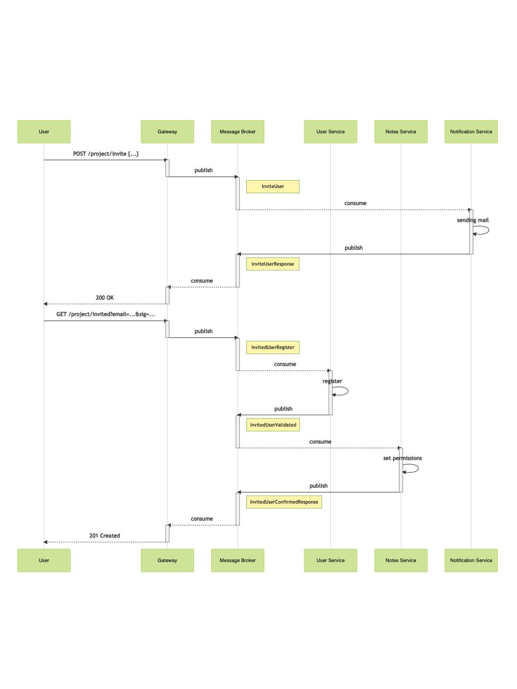

# Паттерны декомпозиции микросервисов

Описание декомпозиции проекта "Обмен заметками" на микросервисы с использованием паттерна "RPC over Message Bus".

## Описание сервиса

Сервис заметок позволяет обмениваться заметками между пользователями. Представляет собой менеджер задач.
Позволяет создавать проекты и заметки внутри проектов. Доступ пользователям к проектам ограничивается.

## Пользовательский сценарий

- Пользователь вводит в форму приглашения в проект email нового участника.
- Пользователю показывается информация об успешной отправке приглашения. 
- Приглашенному пользователю приходит письмо с приглашением в проект по ссылке. 
- Пользователь нажимает на ссылку из письма.
- Пользователю показывается информация об успешной регистрации и получении доступа к новому проекту. 
- Открывается экран с новым проектом.

## Паттерн "RPC over Message Bus"

### Контракты взаимодействия сервисов друг с другом

[Описание ASYNC интерфейсов](./bus-asyncapi.yaml)

### Назначение сервисов

#### Gateway

Отвечает за трансляцию протоколов HTTP -> MQ.

#### User Service

Сервис пользователей отвечает за регистрацию и управление всеми данными пользователей.
Принимает запросы на регистрацию новый пользователей, получение данных о пользователях.

#### Notes Service

Сервис заметок отвечает за управление всеми данными заметок и проектов.

#### Notification Service

Сервис уведомлений отвечает за рассылку информационных сообщений пользователям по определенным событиям.

### Общая схема взаимодействия сервисов

