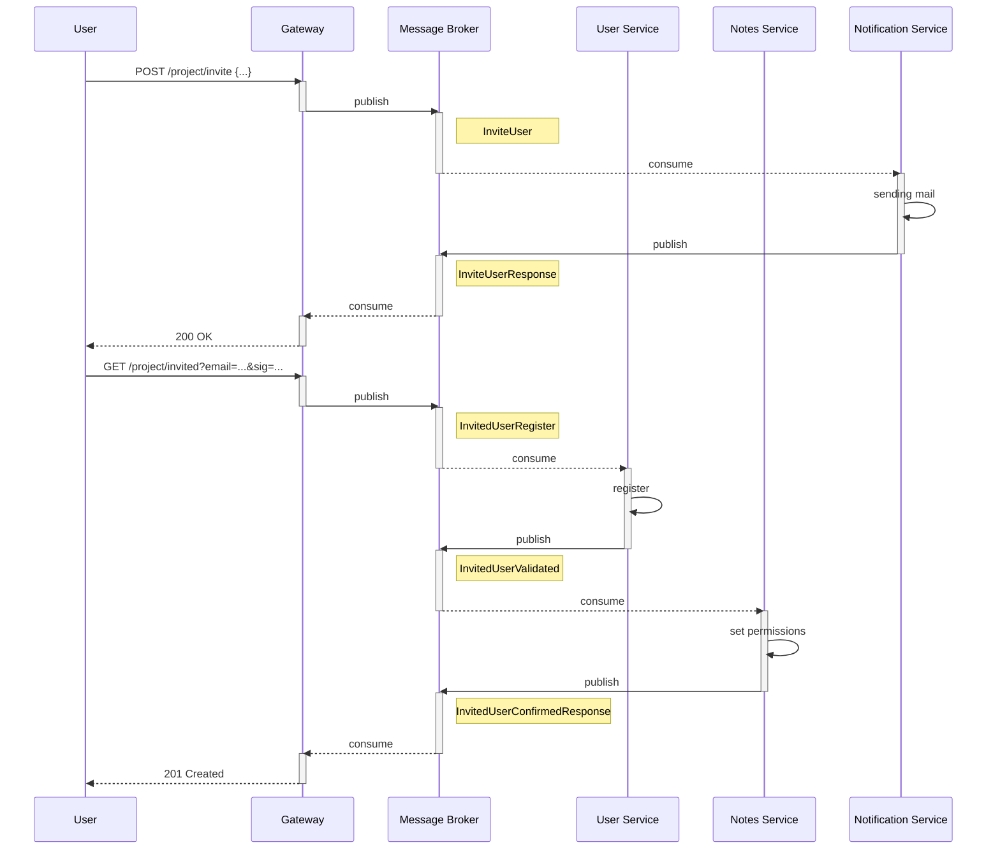

```mermaid
sequenceDiagram
participant User
participant Gateway
participant Message Broker
participant User Service
participant Notes Service
participant Notification Service

User->>Gateway: POST /project/invite {...}
activate Gateway
Gateway->>Message Broker:  publish
deactivate Gateway
activate Message Broker
Note right of Message Broker: InviteUser
Message Broker -->> Notification Service: consume
deactivate Message Broker
activate Notification Service
Notification Service ->> Notification Service: sending mail
Notification Service->>Message Broker: publish
deactivate Notification Service
activate Message Broker
Note right of Message Broker: InviteUserResponse
Message Broker -->> Gateway: consume
deactivate Message Broker
activate Gateway
Gateway -->> User: 200 OK
deactivate Gateway

User->>Gateway: GET /project/invited?email=...&sig=...
activate Gateway
Gateway->>Message Broker:  publish
deactivate Gateway
activate Message Broker
Note right of Message Broker: InvitedUserRegister
Message Broker -->> User Service: consume
deactivate Message Broker
activate User Service
User Service ->> User Service: register
User Service ->> Message Broker: publish
deactivate User Service
activate Message Broker
Note right of Message Broker: InvitedUserValidated
Message Broker -->> Notes Service: consume
deactivate Message Broker
activate Notes Service
Notes Service ->> Notes Service: set permissions
Notes Service ->> Message Broker: publish
deactivate Notes Service
activate Message Broker
Note right of Message Broker: InvitedUserConfirmedResponse
Message Broker -->> Gateway: consume
deactivate Message Broker
activate Gateway
Gateway -->> User: 201 Created
deactivate Gateway
```
